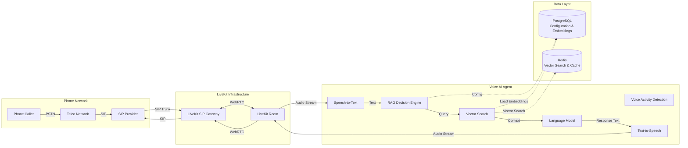
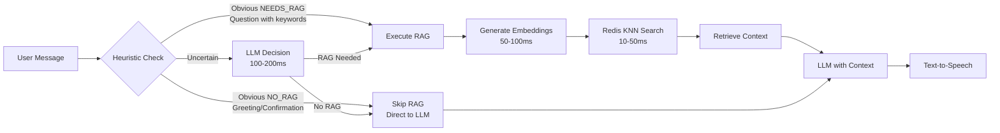

<div style="margin-bottom: 2rem;"><a href="https://livekit-react-red.vercel.app/" target="_blank" style="display: block; text-decoration: none;"></a></div>

## What is this Project

---

This is a real-time voice AI agent that our customers use at [**Rhythmiq**](https://rhythmiqcx.com), and we use it for customer demos. The frontend is served via a customized fork of the LiveKit agents React repo, which you can find [**here**](https://github.com/RythmSharma96/livekit-react). 

I had to make a few tweaks to make it work directly with the existing system because it relies on a bunch of metadata to fetch agent config in real time from the phone number that is receiving the call.

I am the sole developer responsible for designing, implementing, deploying to production, and scaling this entire system.

On the backend, we are using **LiveKit** for real-time communication, the livekit worker processes:
- **Speech-to-Text (STT)** - Converts spoken words into text
- **Large Language Model (LLM)** - Generates intelligent responses
- **Text-to-Speech (TTS)** - Converts responses back to natural speech

The codebase for this LiveKit worker resides under the company [**GitHub Account**](https://github.com/Rhythmiqcx) in a private repository. If you have any questions, please reach out—I'd love to give you a walkthrough! 

The main use cases are **Inbound** and **Outbound** AI calling. We have seamless integration with multiple telephony providers over SIP (Twilio, Plivo, Teler, etc.). The system is used for a plethora of use cases, such as filtering interested candidates before transferring them to a human agent, or reaching out to existing customers to collect feedback. Recordings and transcripts are readily available after calls on Rhythmiq's dashboard.


### The Challenge

---

We ran into many challenges when we started implementing a voice AI solution. I had prior experience with VoIP systems from my time at FreJun, but not much with voice AI or implementing such solutions. Here's what we had to implement:

1. **Ultra-low latency**: Users expect natural conversation flow, requiring end-to-end response times under 1 second
2. **Multi-tenancy**: Different customers need different assistants, which require different configurations, knowledge bases, and voice characteristics
3. **Scalability**: The system must handle concurrent calls without degradation
4. **Cost efficiency**: Real-time AI inference is expensive, and India is a price-sensitive market

Our first instinct was to make a sort of wrapper and use [**Elevenlabs**](https://elevenlabs.io/), [**Vapi**](https://vapi.ai/) or some other providers and keep the customer specific logic in our application. As you might imagine, the costs were too high for us to have any business use case for this. Even when we asked Elevenlabs for a very high usage pricing quote for a custom plan, the price they gave us was still more than 3x of what this pipeline achieves for us. But that makes sense considering they will be taking care of all the technical scale and load for you.

So we moved on to building our own agents. LiveKit allows us to interchange any step of the pipeline (STT, LLM, and TTS) and provide custom price-quality tradeoff-based agents that exactly fit the needs of each individual customer.

## System Architecture

---

The system follows a pipeline architecture where audio flows through discrete stages: Speech-to-Text (STT) → Intelligent RAG Decision (whether to use RAG or not) → Retrieval (if needed) → Language Model (LLM) → Text-to-Speech (TTS). Each stage is independently configurable and can be swapped based on requirements.





#### Core Components


**LiveKit Integration**: LiveKit serves as our real-time communication backbone, handling WebRTC connections, SIP bridging (for phone calls), and audio streaming. The agent connects to LiveKit rooms and processes audio frames in real-time.

**Dynamic Configuration System**: Instead of hardcoding configurations, the system loads assistant-specific settings from PostgreSQL at runtime. This enables true multi-tenancy where each phone number can map to a different assistant with unique STT, LLM, TTS, and RAG settings.

**Redis Vector Search**: We use Redis with RediSearch for vector similarity search. Embeddings are stored as binary vectors (1536 dimensions from OpenAI's `text-embedding-3-small`) and retrieved using KNN (K-Nearest Neighbors) queries.

**PostgreSQL Database**: Stores assistant configurations, phone number mappings, and document embeddings. We use `asyncpg` for async connection pooling to handle concurrent requests efficiently.


## Optimizations

---

Although we do use a set of different providers and locally running models for each step, here are some notable optimizations I think stand out in the system that we did to improve latency greatly:

#### Preemptive Generation

One of our key optimizations is **preemptive generation**: the LLM begins generating a response as soon as the user starts speaking, before they finish. This is enabled by LiveKit's VAD (Voice Activity Detection) and turn detection, which predicts when the user is likely done speaking.

This can reduce perceived latency by 500ms-1s, making conversations feel more natural.

**Faster Whisper (Custom GPU Implementation)**: For scenarios requiring on-premise deployment or specific model customization, we've built a custom Whisper plugin using `faster-whisper`. This implementation includes:

- GPU acceleration with CUDA support
- Model warmup to reduce first-inference latency
- VAD (Voice Activity Detection) filtering to reduce false positives
- Custom initial prompts for domain-specific optimization

**Streaming vs. Batch**: We use streaming STT where available (Deepgram) to minimize latency. For Whisper, we batch process but optimize with VAD to reduce unnecessary inference.

**Language Detection**: Language is specified per-assistant in configuration, avoiding runtime detection overhead.

**Audio Preprocessing**: Audio frames are combined and converted to the format expected by each provider, with format-specific optimizations.

**Kokoro TTS (Custom GPU Implementation)**: For certain use cases, we also run a custom plugin for Kokoro 82M, which is a relatively lightweight model that gives good results for English. Although it's not a state-of-the-art model, it saves us significantly on costs.


## Intelligent RAG System

---

Not every user query requires knowledge base retrieval. Simple greetings, confirmations, or follow-up questions can be answered directly by the LLM. However, questions about specific products, pricing, or features require accurate, up-to-date information from the knowledge base.

The challenge: **How do we decide when to use RAG without adding significant latency?**

### Hybrid Decision-Making Architecture

We've implemented a two-tier decision system that combines fast heuristics with LLM-based classification for uncertain cases.



### Fast-Path Heuristics

For obvious cases, we use regex-based pattern matching that executes in microseconds:

```python
def is_obvious_no_rag(text: str, language_code: str) -> bool:
    """Fast check for greetings, confirmations, small talk."""
    text_lower = text.lower().strip()
    
    # Very short messages
    if len(text_lower) < 10:
        if text_lower in ['?', '!', '.', ',', '...']:
            return True
        short_patterns = [
            r'^(hi|hey|hello|hii)$',
            r'^(yes|no|ok|okay|sure)$',
            r'^(thanks|thank you|thx)$',
        ]
        for pattern in short_patterns:
            if re.match(pattern, text_lower):
                return True
    
    # Small talk patterns
    small_talk_patterns = [
        r'^(how are you|how\'?s it going)$',
        r'^(got it|understood|i see)$',
    ]
    for pattern in small_talk_patterns:
        if re.match(pattern, text_lower):
            return True
    
    return False

def is_obvious_needs_rag(text: str) -> bool:
    """Fast check for questions requiring knowledge base."""
    text_lower = text.lower().strip()
    
    # Questions with specific indicators
    if len(text_lower) > 20 and '?' in text:
        specific_indicators = [
            r'(what is|what are|what does)',
            r'(how to|how do|how can)',
            r'(tell me about|explain|describe)',
            r'(information about|more about|details about)',
        ]
        for pattern in specific_indicators:
            if re.search(pattern, text_lower):
                return True
    
    return False
```

### LLM-Based Classification

For uncertain cases, we use a lightweight LLM (Llama 3.1 8B) to make the decision. This adds 100-200ms but ensures accuracy.


**Key Optimizations**:
- **KNN=1**: We retrieve only the most relevant document to minimize latency
- **Cosine Similarity**: Redis uses cosine distance for semantic similarity
- **Assistant Filtering**: Each search is scoped to the specific assistant's knowledge base

### User Feedback: Filler Words

To provide immediate feedback when RAG is executing, we speak a filler word/phrase before starting retrieval:

```python
if needs_rag_result:
    # Get language-appropriate filler word
    filler = self._get_filler_word(self.language_code, is_complex_question)
    
    # Speak immediately (non-blocking)
    await self.session.say(filler, allow_interruptions=False)
    
    # Execute RAG in parallel
    q_context = await self._fetch_rag_context(rag_content)
```

Filler words are localized:
- English: "One moment", "Let me check", "Hmm, let me see"
- Hindi: "एक मिनट दीजिए", "ठीक है, मैं देखता हूं" etc.

This creates a more natural conversation flow where users know the system is processing their request.


## Future Growth Opportunities

---

We're building new features into our agents every day, from enhanced tool calling to introducing new models at each step of the pipeline. Multimodal models, once prices come down enough, are sure to be added to the mix. If you have any ideas or feedback after using this, or would like to contribute in any way, please let me know.

Also, if you're facing any issues using the demo link above, please reach out. I'll make sure to get back to you!

---

*— Ray*


