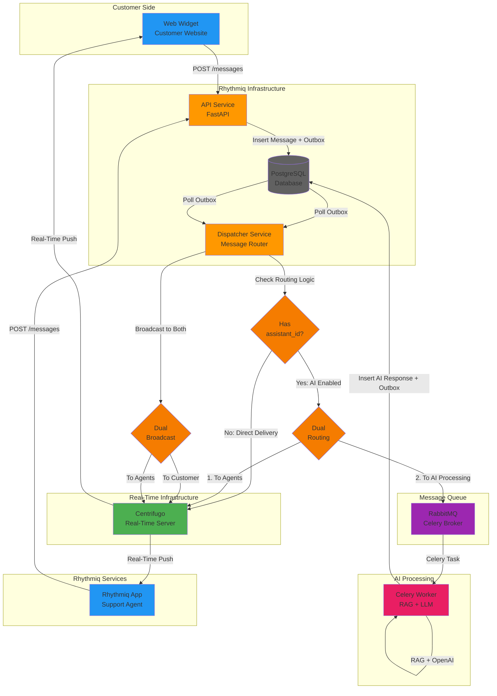

<div style="margin-bottom: 2rem; text-align: center;"><a href="https://rhythmiqcx.com/" target="_blank" style="display: inline-block; text-decoration: none;"></a></div>

## What is this Project

---

This is the actual production chatbot that customers integrate into their websites to respond user queries 24*7 using AI. There is also a fallback threshold that can be set on each Widget individually, so that if the confidence score of AI answering that query is not atleast that much, it can fall back to actual human support keeping a human in the loop at all times.  

I am the sole developer responsible for designing, implementing, deploying to production, and scaling most of this entire system.

The original idea was to make something similar to what Chatwoot or Intercom makes, and you would see the UI almost being very similar to those tools. A customer can come in and configure a Web widget: things like, what color, what welcome message, which agents it will be assigned to etc. and then get a script tag at the end of configuring it. All they need to do now is attach this script tag inside the body tag of their website and the chatbot starts showing. This was initially the main offering we had at [**Rhythmiq**](https://rhythmiqcx.com), until we moved on to [**Voice AI offerings**](/projects/voice-ai-livekit/).

### Code Structure 

---

The project has its code under three repos:

1. **React Web Widget & Loader Script**: The web widget and loader script that customers load onto their website via a script tag. All data is loaded dynamically via a Website Token which is specific to each customer.

2. **Backend Application**: The backend application hosted at [**app.rhythmiqcx.com**](https://app.rhythmiqcx.com). Here you can create an inbox and configure it. You can also create an AI Assistant which is trained on your documents (PDF, Text, etc.). Documents are stored in S3 and then picked up by a scheduler to process one by one and store into the database (the actual content and its vector embeddings are stored in a PostgreSQL table).

3. **Real-time Messaging Infrastructure**: The messaging processing system. The web widget connects via WebSocket to our backend messaging infrastructure called Conduit. We use an outbox pattern to send out messages and a customized RAG pipeline for AI-enabled inboxes to send back AI responses. There's a separate blog post [**here**](https://rhythmiqcx.com/blog/building-conduit-scalable-realtime-messaging-system) on how it works.


## System Architecture

---

The architecture follows a microservices pattern with clear separation of concerns, implementing the outbox pattern for reliable message delivery and using intelligent routing to determine whether messages should be delivered in real-time or processed by AI services. The system is designed for high availability and horizontal scalability.



**Note**: Dual broadcast (sending to both customer and agents) only happens for AI-generated messages. Regular human agent messages are delivered directly to customers via Centrifugo.

#### Core Components

**Component 1: API Service** - The entry point for all message operations, built with FastAPI. This service handles HTTP requests from web widgets and the Rhythmiq application, authenticates users, and creates messages. It implements the outbox pattern by inserting messages and outbox entries within a single database transaction, ensuring reliable message delivery even if downstream services fail. The service also handles hash ID conversion for security, converting customer-facing hash IDs to internal numeric IDs. It exposes RESTful endpoints for message creation, updates, and authentication.

**Component 2: Dispatcher Service** - The routing engine that processes outbox messages and determines their destination. This service polls the outbox table for unpublished messages and implements this exact routing logic: if a contact message has an `assistant_id` associated with the conversation (which means an AI assistant is enabled to answer back queries), it routes the message to RabbitMQ for AI processing; otherwise, it broadcasts directly to Centrifugo for real-time delivery to agents. The dispatcher implements batch processing for optimal performance, fetching recipients and conversation details in batches to minimize database round trips. 

It handles both Centrifugo broadcasting and RabbitMQ publishing with retry logic and error handling.

**Component 3: Centrifugo** - The real-time messaging server that enables instant bidirectional communication between the web widget, Rhythmiq application, and the backend infrastructure. Centrifugo handles WebSocket connections, manages channels for conversations, and broadcasts messages in real-time to all connected clients. For AI messages, Centrifugo performs dual broadcasting: simultaneously delivering responses to both the customer's web widget and the assigned support agents in the Rhythmiq application, ensuring all parties see AI responses instantly. The service supports presence detection, connection recovery, and scalable pub/sub messaging patterns, making it the backbone of the real-time communication layer.


## RAG Implementation

---

The system integrates with an external RAG (Retrieval-Augmented Generation) service for AI-powered customer support. While the RAG implementation itself resides in a separate service, this infrastructure provides the messaging backbone that enables seamless AI integration.

### Retrieval Strategy

When a customer message arrives with an enabled AI assistant, the Celery worker performs semantic retrieval using OpenAI's embedding model (`text-embedding-3-small`) to generate a 1536-dimensional query vector. The system then performs vector similarity search using PostgreSQL's pgvector extension, calculating cosine similarity between the query embedding and pre-computed document embeddings stored in the `chat_ai_assistant_documents` table.

The retrieval process uses a two-tier fallback strategy:

1. **Primary**: Vector similarity search using the `<=>` cosine distance operator, returning the top 5 most relevant documents ordered by similarity score
2. **Fallback**: If vector search returns no results or embedding generation fails, the system falls back to recency-based retrieval, fetching the most recently updated published documents

This approach ensures high-quality context retrieval while maintaining reliability even when embeddings are unavailable. The system also retrieves the last 10 conversation messages in parallel with document retrieval for comprehensive context assembly.

### Context Augmentation

The retrieved context is assembled into a structured prompt that includes:

- **Assistant Configuration**: Retrieved from `chat_ai_assistants` table, including confidence thresholds, fallback messages, and model settings
- **Relevant Documents**: Top 5 documents with their full content, filtered by similarity scores (when vector search is used) or recency
- **Conversation History**: Last 10 messages from the conversation, formatted chronologically to provide context about the ongoing dialogue

Documents are presented with their names and content, conversation history shows sender types (User/Assistant), and the user's current question is highlighted. This augmented context is then sent to OpenAI's GPT-4o-mini model for response generation.

### Response Generation

The LLM client generates responses using OpenAI's chat completions API. The system implements confidence-based response filtering:

- **Confidence Calculation**: Based on average document similarity scores when vector search is used, or a default lower confidence (0.5) for recency-based fallback
- **Threshold Check**: If confidence falls below the assistant's configured threshold, the system returns a predefined fallback message instead of calling the LLM.
- **Response Storage**: Successful responses are saved to `chat_ai_assistant_responses` with metadata including tokens used, cost, response time, and confidence scores

After generation, the AI response is inserted as a new message in the DB with `sender_type=AGENTBOT`, and an outbox entry is created. The dispatcher picks up this outbox entry and broadcasts the response to Centrifugo for real-time delivery to the customer's web widget, completing the RAG pipeline.


## Optimizations

---

The system implements several key optimizations to ensure high performance, reliability, and cost efficiency under load.

#### Optimization 1: Batch Processing and Database Query Optimization

The dispatcher service implements aggressive batch processing to minimize database round trips and improve throughput. Instead of fetching recipient information for each message individually (which would result in N database queries for N messages), the service batches all conversation lookups into just two optimized queries:

- One query for conversations where contacts are senders (to fetch `assignee_id`)
- One query for conversations where users are senders (to fetch `contact_id`)

#### Optimization 2: Outbox Pattern for Reliable Message Delivery

The system implements the transactional outbox pattern to ensure reliable message delivery even in the face of service failures. When a message is created via the API service, both the message insertion and outbox entry creation happen within a single database transaction:

```python
async with tx() as conn:
    message_row = await conn.fetchrow("INSERT INTO chat_messages(...) RETURNING *", ...)
    await conn.execute("INSERT INTO outbox(event_type, payload, published, false) VALUES(...)", ...)
```

This ensures atomicity: either both operations succeed or both fail. The dispatcher service then polls the outbox table for unpublished messages and marks them as published only after successfully broadcasting or publishing them. If a service crashes mid-processing, unpublished messages remain in the outbox and will be retried on the next cycle, providing at-least-once delivery guarantees.

The pattern also enables idempotency: if a message is processed multiple times (due to retries), the system can detect duplicates and handle them appropriately. This is critical for maintaining data consistency in a distributed system.

#### Optimization 3: Parallel Context Retrieval and Confidence-Based Filtering

The RAG implementation optimizes context retrieval by parallelizing independent operations. The system uses `asyncio.gather()` to fetch assistant configuration, generate query embeddings, and retrieve conversation history simultaneously, reducing total retrieval time by up to 60%.


Additionally, HTTP clients are reused across requests within the same event loop, reducing connection overhead. The system tracks detailed metrics (tokens, cost, response time, confidence scores) for each response, enabling data-driven optimization of confidence thresholds and document selection strategies.


## Future Growth Opportunities

---

The architecture is designed with scalability and extensibility in mind, providing several avenues for future enhancement:

**Enhanced AI Capabilities**: The current integration point via RabbitMQ allows for easy extension to support multiple AI providers, or hybrid human-AI workflows. The system could be extended to support AI response streaming, where partial responses are delivered in real-time as they're generated, improving perceived response time.

**Advanced Monitoring and Observability**: Adding metrics export to Prometheus/Grafana would enable comprehensive dashboards and alerting.

**Multi-Region Deployment**: The microservices architecture makes it well-suited for multi-region deployments. 

**Message Prioritization and Queue Management**: Implementing priority queues in RabbitMQ would allow urgent customer messages to be processed faster. Adding message expiration and dead-letter queue handling would improve reliability for edge cases.

**Scalability Improvements**: The system could benefit from horizontal scaling enhancements:
- Database read replicas for the dispatcher service to reduce load on the primary database
- Redis-based caching layer for frequently accessed conversation metadata

That's it folks! I know it got kind of long but I wanted to cover every aspect from top in this. The RAG itself is growing out and we have added BM25 search and semantic chunking etc. The system will be way more developed and polished by the time you will read this. 

Like always, if you have any feedback or questions, shoot me an email.

Also, if you're facing any issues using the demo link above, please reach out. I'll make sure to get back to you!

---

*— Ray*
